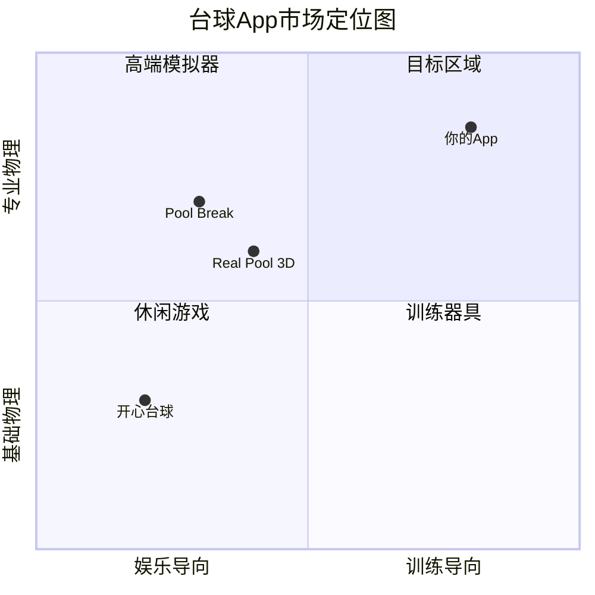

# 台球训练App - 第一阶段：产品定位与核心价值方案

## 一、产品定位声明

**一句话定位**：面向中式八球爱好者的「教练级训练App」—— 用专业物理引擎还原真实球感，用结构化教学体系替代盲目练习。

**核心价值主张**：

- 对初学者：「3个月从入门到能打」—— 系统学会基础杆法、瞄准技巧、简单走位
- 对进阶玩家：「用数据驱动进步」—— 量化技术短板、针对性训练、策略思维培养

---

## 二、目标用户画像与痛点

### 用户群体 A：初学者（60%目标占比）

| 维度 | 描述 |

|------|------|

| 典型画像 | 25-40岁，偶尔去球房社交，想系统学习但不知从何下手 |

| 核心痛点 | 1. 不懂基础：站姿、握杆、瞄准全靠感觉 2. 进步慢：每次打球都在重复错误 3. 学习成本高：请教练贵、自己摸索效率低 |

| 现有替代方案局限 | - 看教学视频：信息碎片、无法互动练习 - 球房练习：时间成本高、无即时反馈 - 现有游戏App：侧重娱乐，缺乏教学深度 |

### 用户群体 B：进阶玩家（40%目标占比）

| 维度 | 描述 |

|------|------|

| 典型画像 | 有1-3年球龄，能稳定进球但走位差、关键球失误多 |

| 核心痛点 | 1. 瓶颈期：技术停滞不知如何突破 2. 缺乏针对性训练：不知道自己哪里弱 3. 策略思维欠缺：只会进球不会布局 |

| 现有替代方案局限 | - 实战练习：没有数据记录，无法量化分析 - 高端模拟器：侧重真实度，缺乏训练引导 |

---

## 三、使用场景设计

### 场景 A：碎片化学习（3-5分钟/次）

```
触发时机：球房等位、通勤间隙、午休时间
功能设计：
├── 快速挑战：随机生成单球进袋练习
├── 杆法速记：交互式杆法效果演示（高杆/低杆/塞）
├── 今日一课：每日推送1个技术点讲解（<2分钟）
└── 复习模式：回顾上次训练的错误球
```

### 场景 B：系统性训练（15-30分钟/次）

```
触发时机：居家时的专注练习时段
功能设计：
├── 阶段课程：从基础到进阶的结构化学习路径
├── 专项训练：瞄准/走位/杆法/清台的独立模块
├── 模拟实战：AI对手+完整比赛+赛后复盘
└── 训练计划：根据目标生成周计划
```

---

## 四、3个月量化目标

### 初学者路径（Level 0 到 Level 1）

| 阶段 | 时间 | 达成目标 | 量化指标 |

|------|------|---------|---------|

| 入门期 | 第1-4周 | 掌握基础姿势与直球瞄准 | 直球入袋率 >= 50% |

| 成长期 | 第5-8周 | 学会高低杆控制母球 | 杆法练习通过率 >= 60% |

| 进阶期 | 第9-12周 | 能完成简单走位连续进球 | 连续进3球成功率 >= 40% |

### 进阶玩家路径（Level 1 到 Level 2）

| 阶段 | 时间 | 达成目标 | 量化指标 |

|------|------|---------|---------|

| 诊断期 | 第1-2周 | 识别技术短板 | 完成全技能评估测试 |

| 突破期 | 第3-8周 | 针对性提升薄弱项 | 目标技能得分提升 >= 20% |

| 整合期 | 第9-12周 | 策略思维与实战整合 | AI对战胜率提升 >= 15% |

---

## 五、差异化竞争策略

### 与现有竞品对比



### 三大差异化支柱

| 维度 | 竞品现状 | 你的差异化策略 |

|------|---------|---------------|

| **物理真实度** | 多数达到80%，但旋转/库边细节不足 | 专业级物理引擎：完整支持旋转衰减、库边修正、非中心击球效果 |

| **教学方法** | 缺乏体系，仅提供提示线 | 结构化教学：技能拆解训练 + AI实时诊断 + 个性化学习路径 |

| **交互体验** | 通用游戏交互 | 训练专属交互：力度/角度可视化数据、慢动作回放、轨迹对比 |

---

## 六、核心功能优先级（V1 建议）

### 必做（MVP）

1. 专业物理引擎（旋转、摩擦、库边）
2. 基础教学课程（6-8课，覆盖站姿到简单走位）
3. 单球/多球练习模式
4. 进度追踪与数据统计

### 可选（V1.1）

1. AI对战模式
2. 每日挑战与成就系统
3. 训练计划生成

### 延后（V2+）

1. 多规则支持（九球、美式八球）
2. 社交功能（好友对战、排行榜）
3. 高级策略课程

---

## 七、关键成功指标（KPI）

| 指标 | 目标值 | 说明 |

|------|-------|------|

| 次日留存率 | >= 40% | 核心体验是否吸引人 |

| 7日留存率 | >= 20% | 教学体系是否有持续价值 |

| 课程完成率 | >= 60% | 教学设计是否有效 |

| 付费转化率 | >= 5% | 免费内容引流效果 |

| App Store 评分 | >= 4.5 | 整体用户满意度 |

---

## 八、已确认决策

| 决策项 | 选择 | 说明 |

|--------|------|------|

| 商业模式 | 免费 + 内购 | 基础功能免费，高级课程/训练模块付费解锁 |

| 技术栈 | Swift + SpriteKit | 原生iOS开发，物理引擎基于SpriteKit(Box2D) |

| 目标平台 | 仅iOS | 专注iPhone用户，不考虑Android |

| V1范围 | 完整MVP | 实现上述MVP功能（物理引擎+基础教学+练习模式+数据统计） |

---

## 九、技术栈概述

### 核心技术选型

| 层级 | 技术选择 | 说明 |

|------|---------|------|

| 开发语言 | Swift 5.x | iOS原生开发语言 |

| UI框架 | SwiftUI + UIKit | SwiftUI为主，复杂交互用UIKit补充 |

| 游戏引擎 | SpriteKit | Apple原生2D游戏框架，内置物理引擎 |

| 物理引擎 | SpriteKit Physics (Box2D) | 需定制扩展旋转、摩擦等参数 |

| 数据持久化 | Core Data / SwiftData | 本地存储用户进度和统计数据 |

| 架构模式 | MVVM | 视图与业务逻辑分离 |

### SpriteKit 物理引擎能力

**原生支持**：

- 刚体碰撞检测
- 基础摩擦力和弹性系数
- 重力和力场效果

**需要定制开发**：

- 台球旋转效果（高杆、低杆、左右塞）
- 母球与目标球的旋转传递
- 库边反弹的旋转修正
- 摩擦力导致的旋转衰减

---

## 十、内购设计建议

### 免费内容（引流）

- 基础教学前3课
- 单球练习模式
- 基础数据统计

### 付费内容（变现）

| 内购项 | 建议定价 | 内容 |

|--------|---------|------|

| 完整教学课程 | ¥18-28 | 全部6-8课教学内容 |

| 进阶训练包 | ¥12-18 | 专项训练模块（走位、杆法等） |

| 高级数据分析 | ¥6-12 | 详细统计图表、弱点诊断 |

| 全功能解锁 | ¥38-48 | 一次性解锁所有付费内容 |

---

## 十一、完整技术体系（教学内容）

### 技术分类与App适配度

#### A. 基础技术（初学者必修）

| 技术名称 | 英文名 | 说明 | App适合度 |

|---------|-------|------|----------|

| 直球 | Straight Shot | 母球、目标球、袋口在一条直线 | ⭐⭐⭐⭐⭐ |

| 角度球 | Angle/Cut Shot | 母球与目标球成一定角度 | ⭐⭐⭐⭐⭐ |

| 厚球/薄球 | Full/Thin Hit | 击球厚度控制 | ⭐⭐⭐⭐⭐ |

| 打点系统 | Cue Ball Contact | 母球上9个主要击点 | ⭐⭐⭐⭐⭐ |

| 分离角 | Angle of Separation | 碰撞后母球与目标球夹角 | ⭐⭐⭐⭐⭐ |

#### B. 杆法系统（核心技能）

| 技术名称 | 英文名 | 说明 | App适合度 |

|---------|-------|------|----------|

| 中杆/定杆 | Center/Stun Shot | 击打母球中心，碰撞后停止 | ⭐⭐⭐⭐⭐ |

| 高杆/跟杆 | Follow Shot | 击打母球上部，带顺旋前进 | ⭐⭐⭐⭐⭐ |

| 低杆/拉杆 | Draw Shot | 击打母球下部，带逆旋后退 | ⭐⭐⭐⭐⭐ |

| 左塞/右塞 | Left/Right English | 击打母球侧面，影响库边反弹 | ⭐⭐⭐⭐⭐ |

| 登杆 | Push Shot | 短距离推进 | ⭐⭐⭐⭐ |

| 刹车球 | Stop Shot | 利用旋转让母球快速停止 | ⭐⭐⭐⭐ |

| 复合杆法 | Combined English | 高/低杆+左/右塞组合 | ⭐⭐⭐⭐⭐ |

#### C. 库边技术（进阶核心）

| 技术名称 | 英文名 | 说明 | App适合度 |

|---------|-------|------|----------|

| 翻袋 | Bank Shot | 目标球碰库边后进袋 | ⭐⭐⭐⭐⭐ |

| 长台翻袋 | Long Bank | 从球台一端翻到另一端 | ⭐⭐⭐⭐⭐ |

| 多库翻袋 | Multi-Rail Bank | 碰多次库边后进袋 | ⭐⭐⭐⭐ |

| K球 | Kick Shot | 母球碰库边后击打目标球 | ⭐⭐⭐⭐⭐ |

| 吃库走位 | Rail Position | 利用库边控制母球落点 | ⭐⭐⭐⭐⭐ |

| 贴库球 | Frozen Ball | 目标球紧贴库边的打法 | ⭐⭐⭐⭐ |

| 勾杆 | Hook Shot | 利用库边绕过障碍球 | ⭐⭐⭐⭐ |

#### D. 组合技术（中高级）

| 技术名称 | 英文名 | 说明 | App适合度 |

|---------|-------|------|----------|

| 传球 | Carom Shot | 母球碰目标球A后再碰球B | ⭐⭐⭐⭐⭐ |

| 组合球 | Combination Shot | 用一个球击打另一个球进袋 | ⭐⭐⭐⭐⭐ |

| 借力球 | Kiss Shot | 利用球与球碰撞改变路线 | ⭐⭐⭐⭐ |

| 让球 | Position Ball | 故意把球打到特定位置 | ⭐⭐⭐⭐ |

| 炸球/散球 | Break Up Cluster | 打散聚集在一起的球堆 | ⭐⭐⭐⭐⭐ |

| 做球 | Leave | 故意把母球留在有利位置 | ⭐⭐⭐⭐⭐ |

#### E. 解球系统（防守与解围）

| 技术名称 | 英文名 | 说明 | App适合度 |

|---------|-------|------|----------|

| 解斯诺克 | Escape Shot | 被障碍球挡住时的解围方法 | ⭐⭐⭐⭐⭐ |

| 薄解 | Thin Escape | 通过极薄击打擦过障碍球 | ⭐⭐⭐⭐⭐ |

| 库边解球 | Kick Escape | 通过库边反弹绕过障碍 | ⭐⭐⭐⭐⭐ |

| 安全球 | Safety Shot | 故意不进球，把对手置于困境 | ⭐⭐⭐⭐⭐ |

| 做斯诺克 | Snooker | 故意制造对手无法直接击打的局面 | ⭐⭐⭐⭐⭐ |

#### F. 颗星公式系统（库边计算）

| 技术名称 | 说明 | App适合度 |

|---------|------|----------|

| 一库颗星 | 出发点 - 目标点 = 瞄准点 | ⭐⭐⭐⭐⭐ |

| 二库颗星 | 基于菱形对角线计算 | ⭐⭐⭐⭐⭐ |

| 三库颗星 | 复合计算（需考虑塞） | ⭐⭐⭐⭐ |

| 塞修正 | 侧旋对反弹角度的影响 | ⭐⭐⭐⭐⭐ |

#### G. 策略系统（App核心优势）

| 策略类型 | 说明 | App适合度 |

|---------|------|----------|

| 走位规划 | 打完当前球后，母球落点预判 | ⭐⭐⭐⭐⭐ |

| 清台思路 | 7个球+黑8的最优进球顺序 | ⭐⭐⭐⭐⭐ |

| 球型识别 | 判断当前局面是进攻还是防守 | ⭐⭐⭐⭐⭐ |

| 风险评估 | 进攻成功率vs失误代价 | ⭐⭐⭐⭐⭐ |

| 开球策略 | 开球力度、角度、目标球选择 | ⭐⭐⭐⭐ |

#### H. 高级技术（视频为主）

| 技术名称 | 英文名 | App适合度 | 原因 |

|---------|-------|----------|-----|

| 跳球 | Jump Shot | ⭐⭐ | 需要特殊出杆角度 |

| 扎杆/弧线球 | Masse Shot | ⭐⭐ | 需要极端塞量 |

---

### 技术优先级分配

#### P0 - V1核心（必须有）

- 瞄准系统：直球、角度球、厚薄球、打点、分离角
- 杆法系统：中杆、高杆、低杆、左右塞
- 走位规划：单球走位、多球思路
- 颗星公式基础：一库颗星计算、可视化标注

#### P1 - V1重要（建议有）

- 翻袋系统：长台翻袋、短台翻袋 + 颗星计算
- K球系统：一库K、多库K + 颗星计算
- 传球/组合：传球、组合球、借力球
- 解球基础：薄解、一库解球

#### P2 - V1.x扩展

- 高级颗星：二库颗星、三库颗星、塞修正
- 高级解球：多库解球、做斯诺克
- 防守系统：安全球、做球、让球
- 炸球系统：炸球时机、炸球走位

#### 延后 - V2+（视频为主）

- 高级杆法：跳球、扎杆
- 身体力学：站姿、握杆、挥杆
- 比赛心理：压力管理、节奏控制

---

### App vs 视频内容分配

| 内容类型 | 实现方式 | 说明 |

|---------|---------|-----|

| 瞄准/打点/分离角 | App交互训练 | 可视化+即时反馈 |

| 杆法效果 | App模拟演示 | 物理引擎核心价值 |

| 走位/策略规划 | App场景训练 | App最大优势 |

| 翻袋/K球/传球 | App专项训练 | 颗星公式辅助 |

| 解球/安全球 | App场景训练 | 策略思维培养 |

| 身体力学 | 视频教学 | 需要真人示范 |

| 高级杆法 | 视频演示 | 需要真实手感 |

| 比赛心理 | 视频讲座 | 专家访谈形式 |

---

### App能力边界声明

**App擅长（理论+策略侧重）**：

- 瞄准理论与打点原理
- 分离角计算与走位规划
- 旋转效果可视化学习
- 颗星公式计算与训练
- 策略思维与多球路线

**仍需真实球桌训练**：

- 握杆手感与发力节奏
- 身体姿态与肌肉记忆
- 真实球速与台面差异
- 比赛心理与临场发挥

---

## 十二、教学体系设计

### 课程结构（共18课）

#### 免费入门课程（3课）- 引流

| 课程 | 主题 | 学习目标 | 时长 |

|------|------|---------|------|

| L1 | 认识台球 | 规则、术语、基本概念 | 5分钟 |

| L2 | 瞄准入门 | 直球瞄准、厚薄球概念 | 8分钟 |

| L3 | 第一次进球 | 完成10个直球进袋 | 10分钟 |

#### 基础课程包（5课）- ¥18

| 课程 | 主题 | 核心技术 |

|------|------|---------|

| L4 | 角度球基础 | 厚薄球、瞄准点 |

| L5 | 打点入门 | 打点系统 |

| L6 | 分离角原理 | 分离角计算 |

| L7 | 左右塞基础 | 左塞、右塞 |

| L8 | 单球走位 | 基础走位 |

#### 进阶课程包（6课）- ¥25

| 课程 | 主题 | 核心技术 |

|------|------|---------|

| L9 | 翻袋入门 | 翻袋、库边反弹 |

| L10 | 颗星公式基础 | 颗星公式 |

| L11 | K球技术 | K球、库边解球 |

| L12 | 传球与组合 | 传球、组合球 |

| L13 | 多球走位 | 多球思路 |

| L14 | 塞修正进阶 | 塞修正 |

#### 高级课程包（4课）- ¥20

| 课程 | 主题 | 核心技术 |

|------|------|---------|

| L15 | 解球策略 | 解斯诺克 |

| L16 | 安全球与防守 | 防守策略 |

| L17 | 清台思路 | 清台规划 |

| L18 | 炸球与散球 | 炸球策略 |

---

### 训练模块设计

#### 专项训练场

| 训练场 | 包含内容 | 难度等级 | 解锁条件 |

|--------|---------|---------|---------|

| 瞄准训练场 | 直球、角度球（30°/45°/60°/90°） | 1-5星 | 免费 |

| 杆法训练场 | 中杆、高杆、低杆、左右塞 | 1-5星 | 基础课程包 |

| 翻袋训练场 | 短台翻、长台翻、角袋翻、中袋翻 | 1-5星 | 进阶课程包 |

| K球训练场 | 一库K、两库K、三库K | 1-5星 | 进阶课程包 |

| 传球训练场 | 传球、组合球、借力球 | 1-5星 | 进阶课程包 |

| 解球训练场 | 薄解、库边解、多库解 | 1-5星 | 高级课程包 |

| 颗星计算器 | 一库/二库颗星公式练习 | 1-5星 | 进阶课程包 |

#### 挑战模式

| 挑战类型 | 说明 | 评分标准 | 解锁条件 |

|---------|------|---------|---------|

| 单球挑战 | 限时进球数 | 60秒内进球数 | 免费 |

| 走位挑战 | 进球+母球落入指定区域 | 走位精准度 | 基础课程包 |

| 连击挑战 | 连续进球不失误 | 最大连击数 | 基础课程包 |

| 清台挑战 | 7+1球清台 | 杆数/时间 | 高级课程包 |

| 场景挑战 | 50+预设场景 | 完成度评分 | 各课程包 |

#### 每日系统

| 功能 | 说明 | 奖励 |

|------|------|------|

| 每日一练 | 每天3个随机练习题 | 经验值+统计 |

| 每日一课 | 推送1个技术点讲解 | 知识积累 |

| 连续签到 | 连续使用奖励 | 解锁徽章 |

---

### 难度曲线设计

#### 5星难度定义（以瞄准训练场为例）

| 星级 | 难度描述 | 具体参数 |

|------|---------|---------|

| ⭐ | 入门 | 直球、距离近（<30cm） |

| ⭐⭐ | 简单 | 30°角度球、中等距离 |

| ⭐⭐⭐ | 中等 | 45°角度球、长距离 |

| ⭐⭐⭐⭐ | 困难 | 60°角度球、贴库球 |

| ⭐⭐⭐⭐⭐ | 专家 | 极薄球（>75°）、超长距离 |

---

### 进度与数据系统

#### 用户等级体系

| 等级 | 名称 | 经验值要求 |

|------|------|-----------|

| Lv.1 | 新手 | 0 |

| Lv.2 | 入门 | 500 |

| Lv.3 | 进阶 | 1500 |

| Lv.4 | 熟练 | 4000 |

| Lv.5 | 专家 | 10000 |

#### 技能雷达图（6维度）

- 瞄准准度
- 杆法控制
- 走位能力
- 库边技术
- 策略思维
- 解球能力

#### 数据统计项

| 统计类别 | 具体指标 |

|---------|---------|

| 进球率 | 总进球率、各角度进球率、各距离进球率 |

| 走位精度 | 母球落点与目标区域偏差 |

| 杆法使用 | 各杆法使用频率、成功率 |

| 常见失误 | 失误类型统计 |

| 练习时长 | 每日/每周/累计练习时长 |

| 课程进度 | 已完成课程、当前学习进度 |

---

### 内购定价策略（无广告）

| 内购项 | 定价 | 包含内容 |

|--------|------|---------|

| 基础课程包 | ¥18 | L4-L8课程 + 杆法训练场 |

| 进阶课程包 | ¥25 | L9-L14课程 + 翻袋/K球/传球/颗星训练场 |

| 高级课程包 | ¥20 | L15-L18课程 + 解球训练场 + 清台挑战 |

| 全功能解锁 | ¥48 | 所有课程 + 所有训练场（推荐） |

**变现策略**：纯付费解锁，不含广告

---

### V1功能范围

#### V1.0 MVP

| 模块 | 具体内容 |

|------|---------|

| 课程系统 | L1-L8（免费+基础课程包） |

| 训练场 | 瞄准训练场、杆法训练场（各3星难度） |

| 挑战模式 | 单球挑战、走位挑战 |

| 数据统计 | 基础进球率、练习时长 |

| 内购 | 基础课程包 |

#### V1.1 迭代

| 模块 | 具体内容 |

|------|---------|

| 课程系统 | L9-L14（进阶课程包） |

| 训练场 | 翻袋、K球、颗星公式 |

| 每日系统 | 每日一练、签到 |

| 内购 | 进阶课程包 |

#### V1.2 迭代

| 模块 | 具体内容 |

|------|---------|

| 课程系统 | L15-L18（高级课程包） |

| 训练场 | 解球、传球 |

| 挑战模式 | 清台挑战、场景挑战 |

| 数据统计 | 完整技能雷达图 |