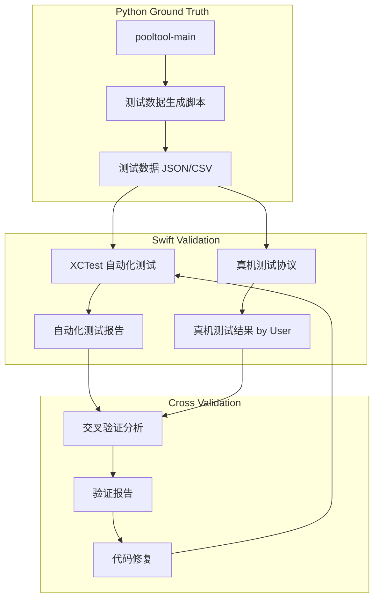

# 验证架构设计文档

---
**Purpose**: 设计物理引擎跨实现验证的测试架构，覆盖自动化测试和真机测试两个通道。

**Approach**:
- 明确自动化测试与真机测试的边界
- 定义 Python→Swift 测试数据流转管道
- 设计交叉验证比对方法论
- 确保测试结果可追溯和可重复
---

## Overview

**Purpose**: 本验证架构用于系统性对比 BilliardTrainer (Swift) 与 pooltool-main (Python) 物理引擎实现的数值一致性。
**Users**: 物理引擎开发者 + 验证者（AI 执行自动化，用户执行真机）。
**Impact**: 发现并修复 Swift 实现与参考基线之间的偏差，确保物理模拟准确性。

### Goals
- 建立完整的自动化验证管道（Python 生成 ground truth → Swift XCTest 消费并比对）
- 定义清晰的真机测试协议（操作步骤 + 预期结果 + 记录格式）
- 实现交叉验证报告自动生成（标记 PASS/FAIL/DEVIATION）
- 建立迭代修复闭环（测试 → 报告 → 修复 → 重测）

### Non-Goals
- 不改变 pooltool 参考实现
- 不追求像素级视觉一致（物理数值一致即可）
- 不覆盖非物理相关的 UI/UX 测试

## Architecture

### 验证架构模式



### Technology Stack

| Layer | Choice / Version | Role in Feature | Notes |
|-------|------------------|-----------------|-------|
| Python 测试 | pytest + numpy | Ground truth 生成与独立验证 | pooltool conda 环境 |
| Swift 测试 | XCTest | 自动化单元测试与集成测试 | Xcode 内置 |
| 测试数据格式 | JSON | Python→Swift 数据传递 | 便于两端解析 |
| 真机测试 | iOS Device | SceneKit 渲染与交互验证 | 用户手动执行 |

## 测试模块划分

### 自动化测试模块（XCTest + pytest）

| 模块 | Swift 函数 | Python 参考 | 测试类型 | 优先级 |
|------|-----------|-------------|---------|--------|
| 四次方程求解 | `QuarticSolver.solveQuartic()` | `ptmath/roots/quartic.py` | 数值精度对比 | P0 |
| 球-球碰撞时间 | `CollisionDetector.ballBallCollisionTime()` | `solve.ball_ball_collision_time()` | 输入输出对比 | P0 |
| 球-直线库边碰撞时间 | `CollisionDetector.ballLinearCushionTime()` | `solve.ball_linear_cushion_collision_time()` | 输入输出对比 | P0 |
| 球-圆弧库边碰撞时间 | `CollisionDetector.ballCircularCushionTime()` | `solve.ball_circular_cushion_collision_time()` | 输入输出对比 | P1 |
| 球-球碰撞响应 | `CollisionResolver.resolveBallBallPure()` | `physics/resolve/ball_ball/` | 碰后速度/旋转对比 | P0 |
| 库边碰撞响应 | `CushionCollisionModel.solve()` | `physics/resolve/ball_cushion/` | 碰后状态对比 | P0 |
| 运动状态演化 | `AnalyticalMotion.evolve*()` | 参考公式 | 位置/速度/旋转对比 | P0 |
| 状态转换时间 | `AnalyticalMotion.*TransitionTime()` | 参考公式 | 时间点精度对比 | P1 |
| 球杆击球 | `CueBallStrike.strike()` | `physics/resolve/ball_stick/` | 击后初始状态对比 | P1 |

### 真机测试模块

| 模块 | 验证内容 | 操作方式 | 判定标准 |
|------|---------|---------|---------|
| 轨迹渲染 | 球运动路径与预测轨迹一致 | 击球后目视检查 | 无明显偏差 |
| 碰撞效果 | 球-球碰撞角度自然合理 | 多角度碰撞测试 | 符合物理直觉 |
| 库边反弹 | 反弹角度与力度合理 | 沿不同角度击向库边 | 入射-反射角关系正确 |
| 袋口行为 | 球进袋/不进袋判定正确 | 各角度击球入袋 | 边缘案例合理 |
| 旋转效果 | 加塞后球路弯曲正确 | 设置 tip offset | 弧线方向正确 |
| 帧率稳定性 | 多球运动时不卡顿 | 开球场景 | ≥30fps |

## 测试数据流

### Ground Truth 生成流程

1. 编写 Python 脚本调用 pooltool 函数
2. 构造参数矩阵（正常值 + 边界值 + 极端值）
3. 收集输出，序列化为 JSON
4. 存入 `BilliardTrainerTests/TestData/`

### 数据格式规范

```json
{
  "module": "ball_ball_collision_time",
  "test_cases": [
    {
      "id": "case_001",
      "description": "正面碰撞，等速相向",
      "input": {
        "ball1_pos": [0.0, 0.0, 0.0],
        "ball1_vel": [1.0, 0.0, 0.0],
        "ball2_pos": [0.5, 0.0, 0.0],
        "ball2_vel": [-1.0, 0.0, 0.0],
        "radius": 0.02625
      },
      "expected_output": {
        "collision_time": 0.11375,
        "tolerance": {
          "abs": 1e-6,
          "rel": 1e-4
        }
      }
    }
  ]
}
```

## Components and Interfaces

### 测试数据生成器 (Python)

| Field | Detail |
|-------|--------|
| Intent | 调用 pooltool 函数生成 ground truth 测试数据 |
| Requirements | 所有需要数值对比的验证需求 |

**Responsibilities & Constraints**
- 为每个验证模块生成覆盖正常/边界/极端情况的测试用例
- 输出标准 JSON 格式，包含输入参数和期望输出
- 记录 pooltool 版本和运行环境信息

### Swift 自动化测试套件 (XCTest)

| Field | Detail |
|-------|--------|
| Intent | 读取 JSON 测试数据，调用 Swift 函数，与 ground truth 比对 |
| Requirements | 所有自动化测试验证需求 |

**Responsibilities & Constraints**
- 加载 JSON 测试数据文件
- 调用对应 Swift 物理函数
- 使用容差比较（`XCTAssertEqual(_:_:accuracy:)`）
- 输出结构化测试报告

### 真机测试协议 (Markdown)

| Field | Detail |
|-------|--------|
| Intent | 定义真机测试步骤、预期结果和结果记录格式 |
| Requirements | 所有真机测试验证需求 |

**Responsibilities & Constraints**
- 每个测试用例包含：前置条件、操作步骤、预期结果、判定标准
- 结果由用户手动记录到指定路径
- 支持截图/录屏附件引用

### 交叉验证报告生成器

| Field | Detail |
|-------|--------|
| Intent | 汇总自动化和真机测试结果，生成统一验证报告 |
| Requirements | 所有验证需求 |

**Responsibilities & Constraints**
- 聚合自动化测试结果和真机测试结果
- 标记每项: PASS / FAIL / DEVIATION / UNTESTED
- 对 FAIL/DEVIATION 项提供偏差量化和修复建议
- 生成可追溯的修复工单

## Testing Strategy

### Unit Tests (自动化 - XCTest)
- 四次方程求解器：多组系数覆盖（包含无实根、重根、极小系数）
- 碰撞时间计算：各角度/速度组合的碰撞检测
- 碰撞响应：碰后速度和角速度验证
- 运动状态演化：各状态下位置/速度随时间变化

### Integration Tests (自动化 - XCTest)
- 事件驱动模拟完整流程：击球→碰撞→状态转换→静止
- 多球场景碰撞事件序列
- 与 pooltool `test_simulate.py` 对标的端到端测试

### Device Tests (真机 - 用户执行)
- 单球直线运动轨迹验证
- 球-球碰撞角度与效果验证
- 库边反弹行为验证
- 开球场景多球碰撞验证
- 旋转球弧线效果验证

## Error Handling

### 数值异常处理
- NaN/Inf 检测和降级策略
- 零时刻碰撞事件保护
- 重叠球体分离处理
- 四次方程无有效根的 fallback

### 测试失败处理
- 自动化测试失败：记录偏差值，标记为 FAIL，继续执行剩余用例
- 真机测试异常：用户记录异常现象，附截图说明
- 交叉验证不通过：生成修复任务，进入下一轮迭代
