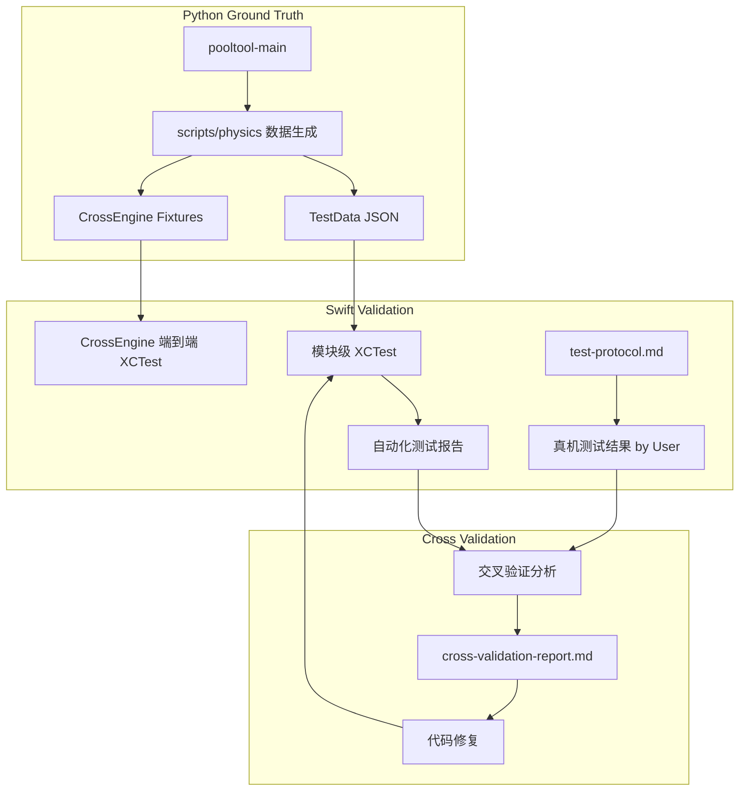

# 验证架构设计文档

---
**Feature**: physics-engine-validation-fix  
**Purpose**: 设计物理引擎跨实现验证的测试架构，覆盖自动化测试和真机测试两个通道。

**Approach**:
- 在现有 CrossEngine 基础设施上扩展模块级自动化测试
- 明确自动化测试与真机测试的边界
- 定义 Python→Swift 测试数据流转管道
- 设计交叉验证比对方法论
- 确保测试结果可追溯和可重复
---

## Overview

**Purpose**: 本验证架构用于系统性对比 BilliardTrainer (Swift) 与 pooltool-main (Python) 物理引擎实现的数值一致性。
**Users**: 物理引擎开发者 + 验证者（AI 执行自动化，用户执行真机）。
**Impact**: 发现并修复 Swift 实现与参考基线之间的偏差，确保物理模拟准确性。

### Goals
- 建立完整的自动化验证管道（Python 生成 ground truth → Swift XCTest 消费并比对）
- 扩展模块级测试数据（Quartic、碰撞时间、碰撞响应等），复用 pooltool 数据
- 保持现有 CrossEngine 端到端测试，并增强其覆盖场景
- 定义清晰的真机测试协议（操作步骤、预期结果、记录格式）
- 实现交叉验证报告自动生成（标记 PASS/FAIL/DEVIATION）
- 建立迭代修复闭环（测试 → 报告 → 修复 → 重测）

### Non-Goals
- 不改变 pooltool 参考实现
- 不追求像素级视觉一致（物理数值一致即可）
- 不覆盖非物理相关的 UI/UX 测试

## Architecture

### 验证架构模式



### 目录结构

```
BilliardTrainer/
├── BilliardTrainerTests/
│   ├── Fixtures/
│   │   └── CrossEngine/              # 端到端场景（已有）
│   │       ├── case-*.input.json
│   │       └── case-*.pooltool-output.json
│   ├── TestData/                     # 模块级 ground truth（新增）
│   │   ├── quartic/                  # 四次方程系数与根
│   │   │   ├── quartic_coeffs.json
│   │   │   └── hard_quartic_coeffs.json
│   │   ├── ball_ball_collision_time/
│   │   ├── ball_linear_cushion_time/
│   │   ├── ball_circular_cushion_time/
│   │   ├── ball_ball_resolve/
│   │   ├── cushion_resolve/
│   │   ├── evolve/
│   │   └── cue_strike/
│   └── Physics/
│       ├── QuarticSolverTests.swift
│       ├── CollisionDetectorTests.swift
│       ├── CollisionResolverTests.swift
│       ├── CushionCollisionModelTests.swift
│       ├── AnalyticalMotionTests.swift
│       ├── CueBallStrikeTests.swift
│       ├── CrossEngineComparisonTests.swift
│       └── PhysicsCrossValidationTests.swift   # 新增：加载 TestData 的模块级对比
│
scripts/physics/
├── export_pooltool_baseline.py       # 已有：端到端 baseline
├── generate_quartic_testdata.py      # 新增：从 pooltool 数据导出 quartic JSON
├── generate_collision_testdata.py   # 新增：碰撞时间/响应 test data
└── requirements.txt                 # 可选：脚本依赖
│
.kiro/specs/physics-engine-validation-fix/
├── test-protocol.md                 # 真机测试协议
├── test-results/
│   ├── automated/                   # 自动化测试结果
│   └── manual/                      # 真机测试结果
└── cross-validation-report.md       # 验证报告模板
```

### Technology Stack

| Layer | Choice / Version | Role in Feature | Notes |
|-------|------------------|-----------------|-------|
| Python 测试 | pytest + numpy | Ground truth 生成与独立验证 | pooltool conda 环境 |
| Swift 测试 | XCTest | 自动化单元测试与集成测试 | Xcode 内置 |
| 测试数据格式 | JSON | Python→Swift 数据传递 | 便于两端解析 |
| 真机测试 | iOS Device | SceneKit 渲染与交互验证 | 用户手动执行 |
| 坐标系 | pooltool Z-up (xy 台面) | Swift Y-up (xz 台面) | 数据生成时需转换 |

## 测试模块划分

### 自动化测试模块（XCTest + pytest）

| 模块 | Swift 函数 | Python 参考 | 测试数据来源 | 优先级 |
|------|-----------|-------------|--------------|--------|
| 四次方程求解 | `QuarticSolver.solveQuartic()` | `ptmath/roots/quartic.py` | pooltool data/*.npy → JSON | P0 |
| 球-球碰撞时间 | `CollisionDetector.ballBallCollisionTime()` | `solve.ball_ball_collision_time()` | generate_collision_testdata.py | P0 |
| 球-直线库边碰撞时间 | `CollisionDetector.ballLinearCushionTime()` | `solve.ball_linear_cushion_collision_time()` | 同上 | P0 |
| 球-圆弧库边碰撞时间 | `CollisionDetector.ballCircularCushionTime()` | `solve.ball_circular_cushion_collision_time()` | 同上 | P1 |
| 球-球碰撞响应 | `CollisionResolver.resolveBallBallPure()` | `physics/resolve/ball_ball/` | 同上 | P0 |
| 库边碰撞响应 | `CushionCollisionModel.solve()` | `physics/resolve/ball_cushion/mathavan_2010/` | 同上 | P0 |
| 解析运动演化 | `AnalyticalMotion.evolve*()` | `physics.evolve` | 同上 | P0 |
| 状态转换时间 | `AnalyticalMotion.*TransitionTime()` | 参考公式 | 同上 | P1 |
| 球杆击球 | `CueBallStrike.strike()` | `stick_ball/instantaneous_point/` | 同上 | P1 |
| 事件驱动引擎 | `EventDrivenEngine.simulate()` | `simulate.simulate()` | CrossEngine fixtures（已有） | P0 |

### 真机测试模块

| 模块 | 验证内容 | 操作方式 | 判定标准 |
|------|---------|---------|---------|
| 轨迹渲染 | 球运动路径与 EventDrivenEngine 预测一致 | 击球后目视检查 | 无明显偏差 |
| 碰撞效果 | 球-球碰撞角度自然合理 | 多角度碰撞测试 | 符合物理直觉 |
| 库边反弹 | 反弹角度与力度合理 | 沿不同角度击向库边 | 入射-反射角关系正确 |
| 袋口行为 | 球进袋/不进袋判定正确 | 各角度击球入袋 | 边缘案例合理 |
| 旋转效果 | 加塞后球路弯曲正确 | 设置 tip offset | 弧线方向正确 |
| 帧率稳定性 | 多球运动时不卡顿 | 开球场景 | ≥30fps |

## 测试数据流

### Ground Truth 生成流程

1. **Quartic**: 从 `pooltool-main/tests/ptmath/roots/data/*.npy` 加载系数与根，导出 JSON
2. **碰撞/演化/击球**: 编写 Python 脚本调用 pooltool 函数，构造参数矩阵，输出 JSON
3. **端到端**: 沿用 `export_pooltool_baseline.py`，输入 `case-*.input.json`，输出 `*.pooltool-output.json`
4. 所有 JSON 存入 `BilliardTrainerTests/TestData/<module>/` 或 `Fixtures/CrossEngine/`

### 数据格式规范

#### 模块级（以 quartic 为例）

```json
{
  "module": "quartic",
  "source": "pooltool ptmath/roots/data",
  "tolerance": { "abs": 1e-5, "rel": 1e-3 },
  "test_cases": [
    {
      "id": "coeff_001",
      "input": { "a": 1.0, "b": 0.0, "c": -2.0, "d": 0.0, "e": 1.0 },
      "expected_real_roots": [1.0, -1.0],
      "notes": "biquadratic"
    }
  ]
}
```

#### 碰撞时间（以 ball_ball 为例）

```json
{
  "module": "ball_ball_collision_time",
  "source": "pooltool solve.ball_ball_collision_time",
  "tolerance": { "abs": 1e-5, "rel": 1e-3 },
  "coordinate_system": "pooltool_xy",
  "test_cases": [
    {
      "id": "case_001",
      "input": {
        "rvw1": [[0, 0, 0.028575], [1, 0, 0], [0, 0, 0]],
        "rvw2": [[0.1, 0, 0.028575], [-1, 0, 0], [0, 0, 0]],
        "s1": 2, "s2": 2, "mu1": 0.2, "mu2": 0.2, "m1": 0.170097, "m2": 0.170097, "g1": 9.81, "g2": 9.81, "R": 0.028575
      },
      "expected": { "collision_time": 0.02, "no_collision": false }
    }
  ]
}
```

> **坐标系约定**: pooltool 数据使用 xy 平面（Z-up）。Swift 消费时需将 (x,y) → (x,z)，或在生成脚本中预转换。

#### 端到端（已有格式）

沿用 `case-*.input.json` + `case-*.pooltool-output.json`，详见 `Fixtures/CrossEngine/README.md`。

## Components and Interfaces

### 测试数据生成器 (Python)

| Field | Detail |
|-------|--------|
| Intent | 调用 pooltool 函数生成 ground truth 测试数据 |
| Location | `scripts/physics/` |
| Requirements | 所有需要数值对比的验证需求 |

**Responsibilities & Constraints**
- 为每个验证模块生成覆盖正常/边界/极端情况的测试用例
- 输出标准 JSON 格式，包含输入参数和期望输出
- 记录 pooltool 版本和运行环境信息
- 坐标系：pooltool 数据可保留 xy 平面，或在脚本中转为 Swift xz，并在 JSON 中标注 `coordinate_system`

### Swift 自动化测试套件 (XCTest)

| Field | Detail |
|-------|--------|
| Intent | 读取 JSON 测试数据，调用 Swift 函数，与 ground truth 比对 |
| Location | `BilliardTrainerTests/Physics/` |
| Requirements | 所有自动化测试验证需求 |

**Responsibilities & Constraints**
- 加载 `TestData/<module>/*.json` 或 CrossEngine fixtures
- 调用对应 Swift 物理函数
- 使用容差比较（`XCTAssertEqual(_:_:accuracy:)` 或自定义 `assertWithinTolerance`）
- 坐标转换：若 JSON 为 pooltool 格式，测试内将 (x,y) → (x,z) 后调用 Swift
- 输出结构化测试报告（可选：写入 `.kiro/specs/.../test-results/automated/`）

### 真机测试协议 (Markdown)

| Field | Detail |
|-------|--------|
| Intent | 定义真机测试步骤、预期结果和结果记录格式 |
| Location | `.kiro/specs/physics-engine-validation-fix/test-protocol.md` |
| Requirements | Requirement 11（真机视觉与交互验证） |

**Responsibilities & Constraints**
- 每个测试用例包含：前置条件、操作步骤、预期结果、判定标准
- 结果由用户手动记录到 `.kiro/specs/physics-engine-validation-fix/test-results/manual/`
- 支持截图/录屏附件引用
- 沿用模板中的 TC-M-001～TC-M-005 等用例

### 交叉验证报告生成器

| Field | Detail |
|-------|--------|
| Intent | 汇总自动化和真机测试结果，生成统一验证报告 |
| Location | `.kiro/specs/physics-engine-validation-fix/cross-validation-report.md` |
| Requirements | 所有验证需求 |

**Responsibilities & Constraints**
- 聚合自动化测试结果和真机测试结果
- 标记每项: PASS / FAIL / DEVIATION / UNTESTED
- 对 FAIL/DEVIATION 项提供偏差量化和修复建议
- 生成可追溯的修复工单

## Testing Strategy

### Unit Tests (自动化 - XCTest)
- **QuarticSolver**: 多组系数覆盖（含无实根、重根、极小系数），使用 pooltool data 导出 JSON
- **碰撞时间**: 各角度/速度/状态组合，使用 generate_collision_testdata.py 产出
- **碰撞响应**: 碰后速度和角速度验证
- **运动演化**: 各状态下位置/速度随时间变化
- **状态转换时间**: 转换时间公式验证

### Integration Tests (自动化 - XCTest)
- **CrossEngineComparisonTests**: 沿用现有，与 pooltool 端到端 baseline 对比
- 扩展 CrossEngine fixtures：增加更多场景（薄球、厚球、多库等）
- 与 pooltool `test_simulate.py` 对标的场景复刻

### Device Tests (真机 - 用户执行)
- TC-M-001: 单球直线运动
- TC-M-002: 球-球正面碰撞
- TC-M-003: 库边反弹
- TC-M-004: 旋转球（加塞）效果
- TC-M-005: 多球开球场景

## 坐标系与数据转换

| 方向 | pooltool | Swift (SceneKit) | 转换 |
|------|----------|-----------------|------|
| 台面平面 | xy | xz | x→x, y→z |
| 上方向 | z | y | z→y |
| 重力 | (0,0,-g) | (0,-g,0) | 已适配 |

- 模块级测试数据：建议在 JSON 中保留 pooltool 原始格式，由 Swift 测试内转换；或在生成脚本中预转换并标注 `coordinate_system: "swift_xz"`。
- 端到端：`export_pooltool_baseline.py` 已有 `to_pool_position` / `to_pool_velocity`，反向转换由测试或引擎内部处理。

## Error Handling

### 数值异常处理
- NaN/Inf 检测和降级策略
- 零时刻碰撞事件保护
- 重叠球体分离处理
- 四次方程无有效根的 fallback
- 测试数据缺失时：`XCTSkip` 并提示运行对应生成脚本

### 测试失败处理
- 自动化测试失败：记录偏差值，标记为 FAIL，继续执行剩余用例
- 真机测试异常：用户记录异常现象，附截图说明
- 交叉验证不通过：生成修复任务，进入下一轮迭代

## 实施优先级

| 阶段 | 内容 | 产出 |
|------|------|------|
| 1 | Quartic 测试数据生成 + XCTest 加载 | TestData/quartic/, QuarticSolverTests 扩展 |
| 2 | 球-球碰撞时间 测试数据 + XCTest | TestData/ball_ball_collision_time/, CollisionDetectorTests 扩展 |
| 3 | 碰撞响应、库边、演化、击球 测试数据 | 各模块 TestData + 测试扩展 |
| 4 | 扩展 CrossEngine 场景 | 新增 case-*.input.json |
| 5 | 真机测试协议定稿 | test-protocol.md |
| 6 | 交叉验证报告流程 | cross-validation-report.md 模板与填写流程 |
