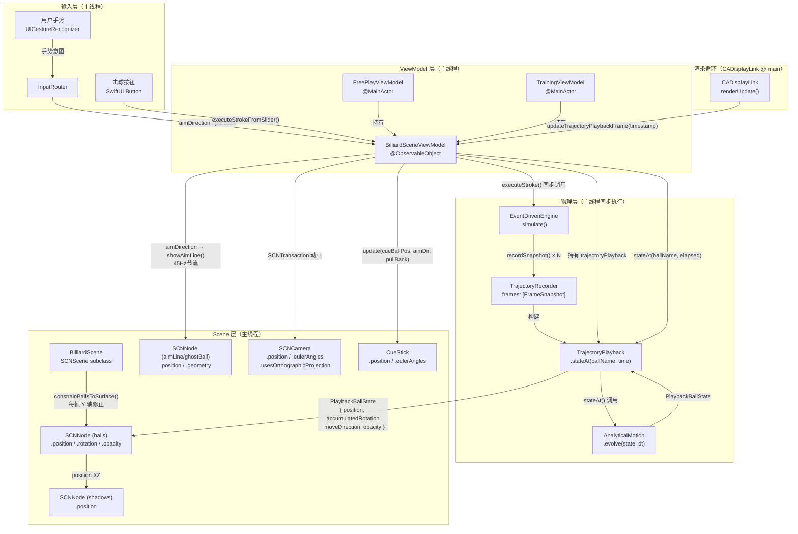

# 物理引擎与 Scene 层同步架构（现状描述）

> 本文档仅描述项目当前实现现状，不包含任何优化建议。
> 代码版本：BilliardTrainer iOS（Swift + SceneKit）

---

## 1. 同步对象清单（What）

### 1.1 球（Ball Nodes）

| 字段 | 类型 | 同步方向 | 说明 |
|------|------|---------|------|
| `position` | `SCNVector3` | 物理 → 渲染 | 每帧由 `TrajectoryPlayback.stateAt()` 计算后直接写入 `SCNNode.position` |
| `rotation` | `SCNVector4` | 物理 → 渲染 | 由 `accumulatedRotation`（累积滚动弧度）+ `moveDirection` 组合计算轴角，写入 `SCNNode.rotation` |
| `velocity` | `SCNVector3` | 物理引擎内部 | 仅存在于 `BallState` 中，不直接写入 SCNNode；SceneKit 自身物理体速度被忽略 |
| `angularVelocity` | `SCNVector3` | 物理引擎内部 | 同上，存于 `BallState`，用于轨迹插值计算，不写 SCNNode |
| `motionState` | `BallMotionState` | 物理引擎内部 | 4 个状态（`sliding` / `rolling` / `spinning` / `stationary`），驱动解析运动模型选择 |
| `opacity` | `CGFloat` | 物理（进袋事件）→ 渲染 | 进袋后在回放中渐变至 0，由 `TrajectoryPlayback.opacity(for:at:)` 计算后写入 `SCNNode.opacity` |
| `isPocketed` | `Bool`（隐含） | 事件 → 渲染 | 无显式字段；进袋事件触发后球节点从场景图移除（`removeFromParentNode()`）并淡出 |
| `isSleeping` | 无 | — | 项目中无此字段；`stationary` 状态对应概念上的静止，但无 sleep/wake 区分 |
| 接触阴影 `shadowNodes[name]` | `SCNVector3.position` | 球 position → shadow | 每帧在 `constrainBallsToSurface()` / `updateShadowPositions()` 中同步到球的 XZ 坐标 |

### 1.2 球杆（Cue Stick）

| 对象/属性 | 驱动来源 | 说明 |
|-----------|---------|------|
| `CueStick` 整体位置/朝向 | 输入驱动（`aimDirection` + `pullBack` + `elevation`） | 在 `renderUpdate()` 中每帧调用 `cueStick?.update(cueBallPosition, aimDirection, pullBack, elevation)`，完全由 ViewModel 瞄准状态驱动 |
| 球杆可见性 | 游戏状态（`GameState`） | `.aiming` 时 `show()`；进入俯视图（2D）时 `hide()`；`ballsMoving` 时 `hide()` |
| 球杆动画（击球后缩回） | 输入驱动 | 由 `CueStick.animateStrike()` 触发 SCNAction 动画，物理引擎不参与 |

### 1.3 瞄准线 / 幽灵球 / 辅助线

| 对象 | 驱动来源 | 说明 |
|------|---------|------|
| `aimLineNode`（瞄准射线） | 输入驱动（`aimDirection`） | 在 `renderUpdate()` 中以 45Hz 节流更新，调用 `scene.showAimLine(from:direction:length:)` |
| `ghostBallNode`（幽灵球） | 输入驱动（预测碰撞点） | 同上，与瞄准线一同更新；位置由射线检测计算得出 |
| 轨迹预测虚线 | 输入驱动（30Hz 节流） | `viewModel.updateTrajectoryPreview()` 在每帧调用，但内部有时间节流（`minInterval: 1/30s`）；用当前 `BallState` 运行轻量模拟后绘制 `SCNCylinder` 线段 |

### 1.4 袋口 / 碰撞事件 / 音效粒子

| 对象/事件 | 驱动来源 | 说明 |
|-----------|---------|------|
| 袋口（pocket）碰撞体 | 静态，无物理驱动 | `pocket_*` 节点为不可见 `SCNPhysicsBody`（kinematic），SceneKit 物理已全局禁用（`physicsWorld.speed = 0`），袋口节点不参与运行时同步 |
| 进袋检测 | `EventDrivenEngine` 内部事件 | 物理模拟期间生成 `.pocketed` 事件，存入 `TrajectoryRecorder`；回放时由 `TrajectoryPlayback` 触发 `onBallPocketed` 回调 |
| 音效触发 | 碰撞事件回调 | `AudioManager` 在 `EventDrivenEngine` 解析碰撞事件时（`resolveEvent`）触发；球-球碰撞、库边碰撞各有对应音效 |
| 粒子效果 | 未发现 | 项目中未使用 `SCNParticleSystem` |

---

## 2. 真源位置（Source of Truth）

### 2.1 物理世界状态真源

**真源**：`EventDrivenEngine` 内部的 `balls: [String: BallState]` 字典，以及由其生成的 `TrajectoryRecorder`（帧快照序列）。

```
BilliardTrainer/Core/Physics/EventDrivenEngine.swift
└── var balls: [String: BallState]        ← 当前模拟时刻所有球状态
└── var trajectoryRecorder: TrajectoryRecorder  ← 全程帧快照
```

`BallState` 结构体（`EventDrivenEngine.swift` 内定义）：

```swift
struct BallState {
    var position: SCNVector3
    var velocity: SCNVector3
    var angularVelocity: SCNVector3
    var state: BallMotionState          // sliding / rolling / spinning / stationary
    var name: String
    var isPocketed: Bool
}
```

**击球完成后**，`EventDrivenEngine` 实例本身不再持有（局部变量），真源转移至 `TrajectoryPlayback`（由 `TrajectoryRecorder` 构建），由 `BilliardSceneViewModel` 持有引用：

```
BilliardTrainer/Core/Scene/BilliardSceneView.swift
└── BilliardSceneViewModel.trajectoryPlayback: TrajectoryPlayback?  ← 运动中的真源
```

**静止态**（无回放时）：渲染节点自身的 `SCNNode.position` 即为事实位置，此时物理世界不存在运行中的 engine 实例。

### 2.2 渲染节点 transform 是否反向写入物理

**否**。渲染节点的 `SCNNode.position` / `SCNNode.rotation` 仅作为展示使用，不存在任何从 SCNNode 读取后写回物理引擎的路径。SceneKit 自身物理体（`SCNPhysicsBody`）虽挂载在球节点上，但因 `physicsWorld.speed = 0` 全局禁用，其 `velocity` 等属性不参与计算。

### 2.3 渲染层 buffer / snapshot

存在。`TrajectoryRecorder` 是物理计算阶段的快照 buffer：

```
BilliardTrainer/Core/Physics/TrajectoryRecorder.swift
└── struct FrameSnapshot { time, ballStates: [String: BallState] }
└── var frames: [FrameSnapshot]   ← 物理模拟期间每次 recordSnapshot() 追加
```

`TrajectoryPlayback` 消费此 buffer，在回放阶段通过二分查找定位基础帧，再以 `AnalyticalMotion` 解析演进到精确时刻：

```
BilliardTrainer/Core/Physics/TrajectoryPlayback.swift
└── func stateAt(ballName: String, time: Float) -> PlaybackBallState?
        ├── 二分查找 frames 中最后一帧 frame.time ≤ time
        └── AnalyticalMotion.evolve(state, dt: time - frame.time) → PlaybackBallState
```

---

## 3. 同步时序（When）

### 3.1 时间线：从用户出杆到球停止

```
┌─────────────────────────────────────────────────────────────────────┐
│  [1] 用户触发击球                                                    │
│      UI 层按钮回调 → BilliardSceneViewModel.executeStrokeFromSlider()│
│      输入层：SwiftUI View → Coordinator → ViewModel                  │
└────────────────────────┬────────────────────────────────────────────┘
                         │ 主线程同步
                         ▼
┌─────────────────────────────────────────────────────────────────────┐
│  [2] 物理全量预计算（主线程同步，阻塞）                              │
│      EventDrivenEngine.simulate(maxEvents:500, maxTime:15.0)        │
│      │                                                              │
│      ├── findNextEvent() → 取最小时刻事件                           │
│      ├── evolveAllBalls(dt) → AnalyticalMotion 推进所有球           │
│      ├── resolveEvent() → 碰撞响应 / 状态转换 / 进袋                │
│      └── recordSnapshot() → 写入 TrajectoryRecorder                 │
│      (循环直到所有球静止或超出 maxEvents / maxTime)                  │
└────────────────────────┬────────────────────────────────────────────┘
                         │
                         ▼
┌─────────────────────────────────────────────────────────────────────┐
│  [3] 启动轨迹回放                                                    │
│      startTrajectoryPlayback(recorder: engine.getTrajectoryRecorder)│
│      │                                                              │
│      ├── TrajectoryPlayback(recorder) 构建                          │
│      ├── playbackStartTime = CACurrentMediaTime()                   │
│      └── gameState = .ballsMoving                                   │
└────────────────────────┬────────────────────────────────────────────┘
                         │
                         ▼
┌─────────────────────────────────────────────────────────────────────┐
│  [4] CADisplayLink 帧驱动回放（主线程，每帧）                        │
│      renderUpdate()                                                 │
│      │                                                              │
│      └── updateTrajectoryPlaybackFrame(timestamp: now)              │
│          │                                                          │
│          ├── elapsed = now - playbackStartTime                      │
│          ├── 对每个 ballNode：                                       │
│          │   TrajectoryPlayback.stateAt(ballName, time: elapsed)    │
│          │       → PlaybackBallState { position, accumulatedRotation│
│          │                             moveDirection, isPocketed }   │
│          ├── ballNode.position = state.position   ← 写 SCNNode      │
│          ├── ballNode.rotation = SCNVector4(...)  ← 写 SCNNode      │
│          ├── ballNode.opacity  = playback.opacity ← 写 SCNNode      │
│          └── [若 elapsed >= totalDuration] → onBallsAtRest()        │
└────────────────────────┬────────────────────────────────────────────┘
                         │
                         ▼
┌─────────────────────────────────────────────────────────────────────┐
│  [5] 回放结束                                                        │
│      onBallsAtRest()                                                │
│      │                                                              │
│      ├── gameState = .turnEnd                                       │
│      ├── 进袋球调用 ball.removeFromParentNode()                     │
│      └── DispatchQueue.main.asyncAfter(1.0s) → prepareNextShot()   │
└─────────────────────────────────────────────────────────────────────┘
```

### 3.2 Scene 更新触发点

| 触发源 | 文件位置 | 作用 |
|--------|---------|------|
| `CADisplayLink` | `BilliardSceneView.swift` `Coordinator.startRenderLoop()` | 主更新循环，驱动球位置写入 |
| `SCNSceneRendererDelegate` | 未使用 | 项目未实现此协议 |
| `Timer(60Hz)` | `PhysicsEngine.swift` `startSimulation()` | 旧引擎遗留，当前主流程不使用 |
| `SCNTransaction` | `BilliardScene.swift` 相机切换 | 仅用于相机动画，不涉及球同步 |

---

## 4. 同步方法（How）

### 4.1 球节点位置同步

对每个球节点逐个直接写 `SCNNode.position` 和 `SCNNode.rotation`：

```swift
// BilliardSceneView.swift  updateTrajectoryPlaybackFrame()
for ballNode in allBallNodes {
    guard let name = ballNode.name else { continue }
    guard let state = playback.stateAt(ballName: name, time: elapsed) else { continue }

    ballNode.position = state.position

    if state.accumulatedRotation > 0.001, state.moveDirection.length() > 0.001 {
        let axis = SCNVector3(0, 1, 0).cross(state.moveDirection).normalized()
        if axis.length() > 0.001 {
            ballNode.rotation = SCNVector4(axis.x, axis.y, axis.z, state.accumulatedRotation)
        }
    }
    ballNode.opacity = playback.opacity(for: name, at: elapsed)
}
```

不使用 `SCNAction`（`TrajectoryRecorder` 中存在 `action()` 方法但当前主流程未调用）。

### 4.2 台面约束补丁

每帧额外调用 `constrainBallsToSurface()`（`BilliardScene.swift`），强制所有球 Y 坐标保持为 `TablePhysics.height + BallPhysics.radius`，同步修正 SceneKit 物理体的 Y 轴速度分量（置零），并同步更新接触阴影节点 XZ 位置。

### 4.3 插值 / 平滑

`TrajectoryPlayback.stateAt()` 在基础快照帧之间使用 `AnalyticalMotion.evolve()` 做解析演进（非线性插值），精确还原当前时刻的物理状态（含 sliding / rolling / spinning 各自的运动方程），而非简单线性插值。

### 4.4 事件驱动同步

不存在运行时事件回调式同步。进袋、碰撞等事件在击球时由物理引擎预计算并写入 `TrajectoryRecorder`，回放阶段按时间轴顺序触发，属于"时间轴播放"而非"实时事件回调"。

音效触发在 `EventDrivenEngine.resolveEvent()` 内（物理预计算阶段，主线程）由 `AudioManager` 立即调用。

---

## 5. 线程与边界（Where）

| 操作 | 执行线程 | 说明 |
|------|---------|------|
| `EventDrivenEngine.simulate()` | 主线程（同步阻塞） | 在 `executeStroke()` 内直接调用，无 background dispatch |
| `TrajectoryRecorder.recordSnapshot()` | 主线程（同上） | 物理模拟内部调用 |
| `CADisplayLink.renderUpdate()` | 主线程（`.main` run loop） | `displayLink?.add(to: .main, forMode: .common)` |
| `ballNode.position = ...` 写入 | 主线程 | `renderUpdate()` 内执行 |
| `BilliardSceneViewModel` @Published 更新 | 主线程 | 类为 `ObservableObject`，未标注 `@MainActor`，但所有写入路径均在主线程 |
| `FreePlayViewModel` / `TrainingViewModel` | `@MainActor` | 显式标注 |
| `DispatchQueue.main.asyncAfter` | 主线程（延迟） | 回合结束后延迟 1.0s / 犯规后延迟 1.5s / 视角锁定解除延迟 0.55s |
| `DispatchQueue.main.async`（渲染质量降级） | 主线程（异步） | 材质重建延迟到下帧，避免同帧卡顿 |
| `Timer(1Hz)` 训练计时器 | Timer 线程，`Task { @MainActor in }` 包装后在主 actor 执行 | `TrainingViewModel.updateTimer()` |

**队列切换**：物理计算与 Scene 写入均在主线程，不存在跨线程同步需求，也不存在锁或信号量。

---

## 6. Reset / 重开 / 切模式下的同步规则

### 6.1 Reset 流程

**物理 state 重置**：无独立物理世界状态需要重置。`EventDrivenEngine` 为局部变量，击球完成后即释放；`TrajectoryPlayback` 在 `onBallsAtRest()` 后置 nil。无残留物理状态。

**渲染节点重置**（`BilliardScene.resetScene()`）：

1. 遍历 `initialBallPositions`（初始位置字典，场景初始化时记录）；
2. 若球节点已从 scene graph 移除（进袋），调用 `rootNode.addChildNode(ball)` 重新加入，并将 `opacity` 置回 1.0；
3. 直接设置 `ball.position = initialPosition`；
4. 重建 `targetBallNodes` 数组；
5. 重置接触阴影节点位置；
6. 调用 `scene.setupRackLayout()` 重新摆三角阵（仅 FreePlay）。

**游戏规则状态重置**：`gameManager.reset()`，独立于物理与渲染。

### 6.2 2D / 3D 切换

**物理是否暂停**：不涉及。切换时不存在正在运行的物理引擎（`EventDrivenEngine` 是一次性计算）。若球正在运动（`ballsMoving` 状态），`CADisplayLink` 继续驱动 `TrajectoryPlayback` 回放，切换视图不中断回放。

**渲染是否重建**：不重建场景。切换仅改变 `SCNCamera` 的投影方式（`usesOrthographicProjection`）和相机 `position` / `eulerAngles`，所有球节点、台面节点保持不变。

**state 是否复用**：`BilliardSceneViewModel` 的所有状态（`gameState`、`aimDirection`、`trajectoryPlayback` 等）全部复用，切换前后连续。

**2D 切换具体步骤**（`BilliardScene.transitionToTopDownTwoPhase()`）：
- 第一段（0.24s）：透视投影下相机移至高位，窄 FOV；
- 第二段（0.26s）：切换为正交投影（`usesOrthographicProjection = true`），相机移至正上方（eulerX = -90°）；
- 球杆节点 `hide()`，瞄准线隐藏。

**3D 切回步骤**（`BilliardScene.transitionToPerspectiveTwoPhase()`）：
- 第一段：正交投影相机移至高视角过渡位置；
- 第二段：切回透视投影，交由 `CameraRig.returnToAim()` 做剩余平滑恢复。

---

## 7. 同步架构图（现状）

### 整体数据流



### 读写关系标注

```
┌──────────────────────────────────────────────────────────────────┐
│  谁读谁写 一览                                                    │
├────────────────────────┬────────────┬────────────────────────────┤
│  操作                  │  读（R）   │  写（W）                    │
├────────────────────────┼────────────┼────────────────────────────┤
│ EventDrivenEngine      │ BallState  │ TrajectoryRecorder.frames   │
│ TrajectoryPlayback     │ TR.frames  │ 无（只读 buffer）           │
│ AnalyticalMotion       │ BallState  │ PlaybackBallState（返回值） │
│ renderUpdate()         │ TP.stateAt │ SCNNode.position/rotation   │
│                        │           │ SCNNode.opacity              │
│ constrainBallsToSurface│ SCNNode.position │ SCNNode.position.y   │
│                        │           │ SCNNode.physicsBody.velocity │
│                        │           │ shadowNode.position          │
│ cueStick?.update()     │ BSVM.aimDirection │ CueStick SCNNode   │
│ showAimLine()          │ BSVM.aimDirection │ aimLineNode/ghostBall│
│ resetScene()           │ initialBallPositions │ SCNNode.position │
│                        │           │ SCNNode.opacity              │
│                        │           │ SCNNode.parent（重新加入）   │
└────────────────────────┴────────────┴────────────────────────────┘
```

### 击球完整时序图

```
时间轴
  │
  ▼
[t=0]   用户点击击球按钮
        SwiftUI Button → BilliardSceneViewModel.executeStroke(power:)
        │
        ├─ [同步] EventDrivenEngine.simulate()
        │         ├─ evolveAllBalls + resolveEvent × N
        │         └─ recordSnapshot() × N → TrajectoryRecorder
        │
        ├─ TrajectoryPlayback 构建
        ├─ playbackStartTime = CACurrentMediaTime()
        └─ gameState = .ballsMoving

[t=0+]  CADisplayLink.renderUpdate() 首帧
        elapsed = now - playbackStartTime ≈ 0
        → stateAt(each ball, time: 0) → 初始位置
        → SCNNode.position = initialPosition

[每帧]  CADisplayLink.renderUpdate()
        elapsed += frameInterval
        → stateAt(each ball, time: elapsed)
           → 二分查找基础帧
           → AnalyticalMotion.evolve(dt) 解析演进
        → SCNNode.position = state.position
        → SCNNode.rotation = SCNVector4(axis, accumulatedRotation)
        → SCNNode.opacity  = playback.opacity(for:at:)
        → updateShadowPositions()

[t=T]   elapsed >= playback.totalDuration
        → onBallsAtRest()
        → 进袋球 removeFromParentNode()
        → gameState = .turnEnd
        → trajectoryPlayback = nil

[t=T+1s] DispatchQueue.main.asyncAfter(1.0)
          → prepareNextShot() → gameState = .aiming
```

---

## 附录：关键文件索引

| 职责 | 文件 | 关键函数 |
|------|------|---------|
| 物理全量预计算 | `Core/Physics/EventDrivenEngine.swift` | `simulate()`, `evolveAllBalls()`, `resolveEvent()`, `recordSnapshot()` |
| 运动状态枚举 | `Core/Physics/BallMotionState.swift` | `BallMotionState`（enum） |
| 解析运动积分 | `Core/Physics/AnalyticalMotion.swift` | `evolve(state:dt:)` |
| 帧快照序列 | `Core/Physics/TrajectoryRecorder.swift` | `recordFrame()`, `frames` |
| 回放插值 | `Core/Physics/TrajectoryPlayback.swift` | `stateAt(ballName:time:)`, `opacity(for:at:)` |
| 击球力学 | `Core/Physics/CueBallStrike.swift` | `computeCueStrike()` |
| 场景/节点管理 | `Core/Scene/BilliardScene.swift` | `setupPhysics()`, `resetScene()`, `constrainBallsToSurface()`, `setupRackLayout()` |
| 主渲染循环 + ViewModel | `Core/Scene/BilliardSceneView.swift` | `renderUpdate()`, `executeStroke()`, `updateTrajectoryPlaybackFrame()`, `startTrajectoryPlayback()`, `toggleViewMode()` |
| 相机平滑 | `Core/Scene/CameraRig.swift` | `update(deltaTime:)`, `returnToAim()` |
| 球杆渲染 | `Core/Scene/CueStick.swift` | `update(cueBallPos:aimDir:pullBack:elevation:)`, `animateStrike()` |
| 瞄准线/预测 | `Core/Scene/BilliardScene.swift` | `showAimLine()`, `updateTrajectoryPreview()` |
| 自由对战 ViewModel | `Features/FreePlay/ViewModels/FreePlayViewModel.swift` | `startNewGame()`, `prepareNextShot()` |
| 训练 ViewModel | `Features/Training/ViewModels/TrainingViewModel.swift` | `startTraining()`, `setupScene()` |
